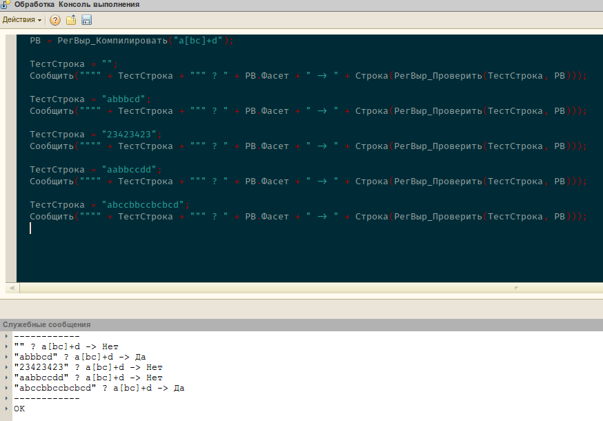

# Регулярные выражения в 1С

Регулярные выражания в 1С без использования внешних компонент (через XDTO фасеты)

* `Функция РегВыр_Компилировать(Фасет) Экспорт`

    Компилирует регулярное выражение и возвращает мутабельную структуру

    <blockquote>
    

    СтрукВозвр = Новый Структура;  
  	СтрукВозвр.Вставить("Тип", "КомпилированныйФасет");
    // Для определения, что структура явлается фасетом 
  	СтрукВозвр.Вставить("Фасет", Фасет);
    // Текст регулярки 
  	СтрукВозвр.Вставить("Тест", Тест);
    // компилированный фасет  
    

    </blockquote>

* `Функция РегВыр_Проверить(Строка, Регул) Экспорт`

  Проверяет строку на соответствие выражению.  
  Принимает в качестве второго параметра: выражение в виде текста
  либо в виде скомпилированной структуры

------------

